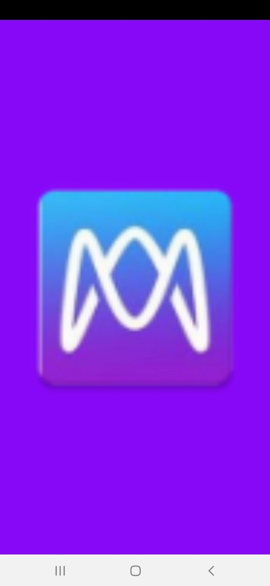
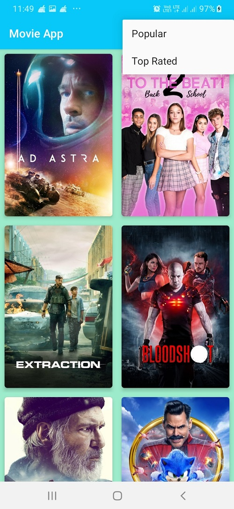
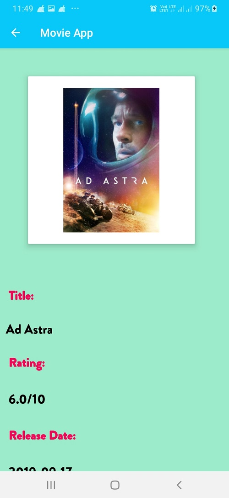

# Popular Movie App (Stage 1)

# Overview

 This project is apart of the Udacity Android Developer Nanodegree. In this project (stage 1 of 2), we were prompted to build an app to     allow users to discover the most popular movies playing.
 
 # Used libraries
  # 1.Retrofit Library
    1. retrofit:2.6.0
    2. converter-gson:2.6.0
   
   # 2.Glide Library
     1. glide:4.9.0
     
   # 3.ApiKey
     https://www.themoviedb.org/
     
# App Images
  # Main
  
  

 # Home

  
 # Home

  
  
 # Detail

  
